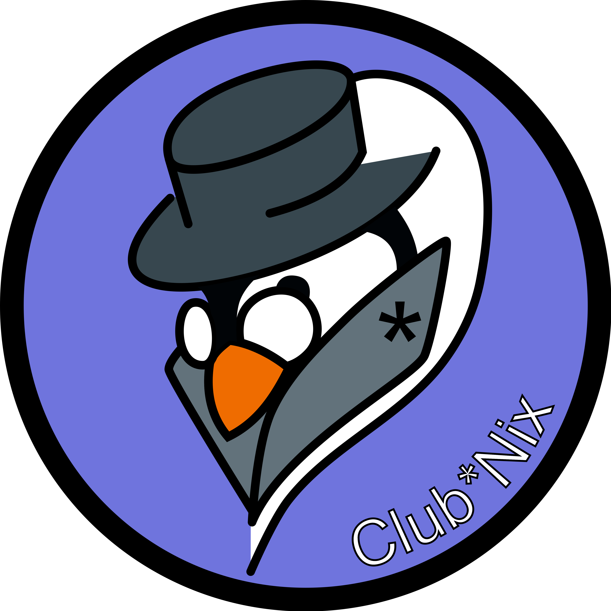

  
  <h1 align="center">Hello 👋</h1>

---

# What is the Club\*Nix ?
Club\*Nix is a non-profit organization created in 2001 and located at ESIEE Paris.  
Our main goal is to promote computer science by presenting it to the other students or also help them. We are also deeply focused on promoting open-source !

# Our projects
Our group has a lot of projects and each year we create new ones !

The most important one is our annual informatics lessons for the Champs-sur-Marne's children. Each year since 2019 we conduct 6 coding lessons to children between 8 and 10 years old. Explaining them the basics of informatics, programming and teaching them the dangers of internet and how to secure themselves.

During the year we also conduct several events at school like presentations of new technologies or revising sessions in programming, networks etc... before the exams for the students.

We also have a lot of technical projects that you can find on our [organization github page](https://github.com/ClubNix/)

# Contacts

You can contact us on :
- club.nix@edu.esiee.fr
- https://linktr.ee/clubnix

<!--
**Club-Nix/Club-Nix** is a ✨ _special_ ✨ repository because its `README.md` (this file) appears on your GitHub profile.

Here are some ideas to get you started:

- 🔭 I’m currently working on ...
- 🌱 I’m currently learning ...
- 👯 I’m looking to collaborate on ...
- 🤔 I’m looking for help with ...
- 💬 Ask me about ...
- 📫 How to reach me: ...
- 😄 Pronouns: ...
- ⚡ Fun fact: ...
-->
